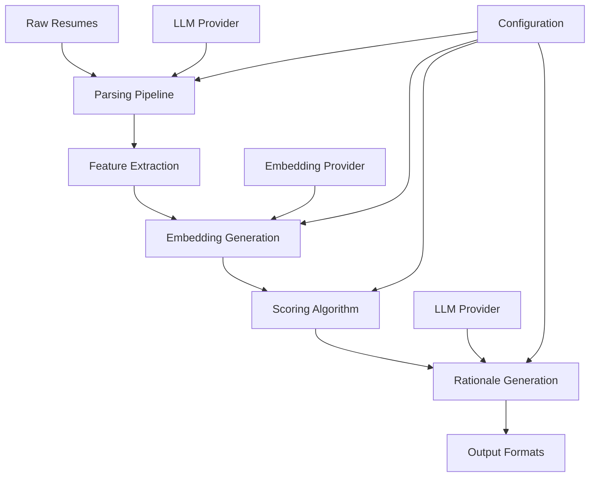

# JD-Fit Evaluator Architecture

## Overview

The JD-Fit Evaluator is a multi-signal candidate-to-job fit evaluation system that follows a unified package architecture. This document explains the system design principles, import rules, and architectural decisions made during the project's evolution from a collection of scripts to a cohesive Python package.

## System Design Principles

### 1. Unified Package Structure

All code is organized under the `jd_fit_evaluator` package namespace:

```
src/jd_fit_evaluator/
├── cli.py              # CLI entrypoints
├── config.py           # Configuration management
├── models/             # LLM and embedding providers
├── parsing/            # Resume parsing logic
├── scoring/            # Fit evaluation algorithms
├── training/           # Model training utilities
└── mapping/            # Data transformation utilities
```

### 2. Import Rules and Enforcement

**✅ Correct Import Patterns:**
```python
# Package-relative imports (preferred within package)
from .models.embeddings import get_embeddings
from .scoring.features import extract_features

# Absolute package imports (from external modules)
from jd_fit_evaluator.cli import main
from jd_fit_evaluator.scoring.finalize import compute_fit_score
```

**❌ Prohibited Import Patterns:**
```python
# Legacy src.* imports (violates package encapsulation)
from src.scoring.features import extract_features

# Direct scoring.* imports (bypasses package namespace)
from scoring.weights import get_weights

# sys.path hacks (breaks proper Python packaging)
import sys
sys.path.insert(0, "src")
```

### 3. Module Responsibilities

#### Core Modules

- **`cli.py`**: Command-line interface and workflow orchestration
- **`config.py`**: Centralized configuration using Pydantic settings
- **`models/`**: External service integrations (OpenAI, Ollama, Mock providers)
- **`scoring/`**: Core evaluation algorithms and feature extraction
- **`parsing/`**: Resume processing and data extraction
- **`training/`**: Model training and optimization utilities

#### Supporting Components

- **`app/api.py`**: FastAPI REST interface
- **`ui/app.py`**: Streamlit web interface
- **`optimized_final_run.py`**: Batch processing orchestration
- **`tools/`**: Data ingestion and preprocessing utilities

## Data Flow Architecture



### Data Transformation Stages

1. **Ingestion**: Raw resume files → structured candidate JSON
2. **Parsing**: Resume text → extracted skills, experience, education
3. **Feature Extraction**: Structured data → numerical features
4. **Embedding**: Text content → vector representations
5. **Scoring**: Features + embeddings → fit scores + rationales
6. **Output**: Scores → JSON, CSV, UI formats

## Provider Architecture

The system supports multiple providers with graceful fallbacks:

### Embedding Providers
- **OpenAI**: Production-grade embeddings via API
- **Ollama**: Local embeddings for privacy/cost optimization
- **Mock**: Deterministic embeddings for testing

### LLM Providers
- **OpenAI**: GPT models for parsing and rationale generation
- **Ollama**: Local models (llama2, mistral, etc.)
- **Mock**: Fixed responses for testing and development

### Provider Selection Logic

```python
# Providers are selected based on configuration:
# 1. Explicit provider setting in config
# 2. Environment variable detection
# 3. Graceful fallback to mock provider
```

## Configuration Management

### Settings Hierarchy

1. **Environment Variables**: `JD_FIT_*` prefixed variables
2. **Configuration Files**: `.env`, `config.yaml`
3. **Default Values**: Defined in `config.py`

### Provider Configuration

```python
# OpenAI Configuration
OPENAI_API_KEY=sk-...
JD_FIT_EMBEDDING_PROVIDER=openai
JD_FIT_LLM_PROVIDER=openai

# Ollama Configuration
JD_FIT_EMBEDDING_PROVIDER=ollama
JD_FIT_LLM_PROVIDER=ollama
JD_FIT_OLLAMA_BASE_URL=http://localhost:11434

# Mock Configuration (default)
JD_FIT_EMBEDDING_PROVIDER=mock
JD_FIT_LLM_PROVIDER=mock
```

## Scoring Algorithm Architecture

### Multi-Signal Evaluation

The scoring system combines multiple signals:

1. **Skills Matching**: Technical and soft skills alignment
2. **Experience Relevance**: Role and industry experience fit
3. **Education Alignment**: Degree and field relevance
4. **Career Progression**: Growth trajectory analysis
5. **Embedding Similarity**: Semantic similarity between candidate and job

### Weighted Scoring

```python
# Configurable weights in scoring/weights.py
final_score = (
    skills_score * SKILLS_WEIGHT +
    experience_score * EXPERIENCE_WEIGHT +
    education_score * EDUCATION_WEIGHT +
    progression_score * PROGRESSION_WEIGHT +
    similarity_score * SIMILARITY_WEIGHT
)
```

## Testing Architecture

### Test Categories

1. **Unit Tests**: Individual function and class testing
2. **Integration Tests**: Component interaction testing
3. **End-to-End Tests**: Full workflow validation
4. **Performance Tests**: Batch processing benchmarks
5. **Golden Tests**: Output regression validation

### Test Organization

```
tests/
├── unit/           # Fast, isolated tests
├── integration/    # Component interaction tests
├── e2e/           # Full workflow tests
├── fixtures/      # Test data and mocks
├── goldens/       # Expected output samples
└── manual/        # Manual verification scripts
```

## Common Pitfalls and Solutions

### 1. Import Violations

**Problem**: Using legacy import patterns breaks package encapsulation
**Solution**: Always use `jd_fit_evaluator.*` imports for package code

**Detection**: Run `make guardpaths` to check for violations

### 2. Provider Configuration Issues

**Problem**: External services not configured properly
**Solution**: Use graceful fallbacks to mock providers

**Debugging**: Check provider status with health commands

### 3. Path Dependencies

**Problem**: Hard-coded relative paths break in different environments
**Solution**: Use `pathlib.Path` and configuration-based paths

### 4. Performance Issues

**Problem**: Large batch processing consumes too much memory
**Solution**: Use streaming processing and configurable batch sizes

## Development Workflow

### 1. Local Development Setup

```bash
# Create virtual environment
python -m venv .venv
source .venv/bin/activate

# Install with development dependencies
pip install -e ".[dev]"

# Install git hooks
bash scripts/install_hooks.sh
```

### 2. Code Quality Checks

```bash
# Run all validation checks
make guardpaths    # Import pattern validation
pytest            # Test suite
ruff check        # Linting
```

### 3. Batch Processing Validation

```bash
# Run smoke test for batch processing
bash scripts/smoke_final_run.sh
```

## Security Considerations

### API Key Management
- Never commit API keys to version control
- Use environment variables or secure configuration files
- Implement key rotation procedures

### Data Privacy
- Candidate data should be handled according to privacy regulations
- Implement data retention and deletion policies
- Use local processing (Ollama) for sensitive data

### Input Validation
- Validate all resume inputs for malicious content
- Sanitize file paths and names
- Implement rate limiting for API endpoints

## Performance Optimization

### Batch Processing
- Use concurrent processing for I/O-bound operations
- Implement configurable batch sizes
- Monitor memory usage during large runs

### Embedding Optimization
- Cache embeddings to avoid recomputation
- Use batch embedding APIs when available
- Consider dimensionality reduction for large datasets

### Model Training
- Use incremental learning for large datasets
- Implement cross-validation for model selection
- Monitor training metrics and early stopping

## Monitoring and Observability

### Logging
- Structured logging with configurable levels
- Request/response logging for API endpoints
- Performance metrics collection

### Health Checks
- Provider availability monitoring
- System resource utilization
- End-to-end workflow validation

### Error Handling
- Graceful degradation for external service failures
- Comprehensive error messages and recovery suggestions
- Automated retry mechanisms with exponential backoff